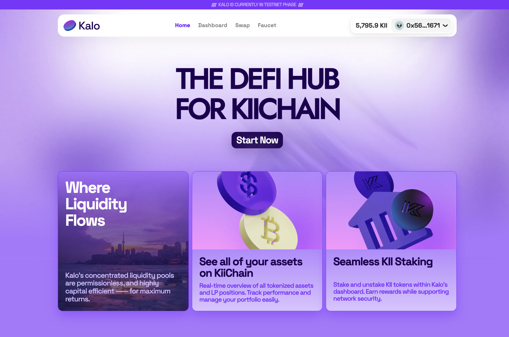
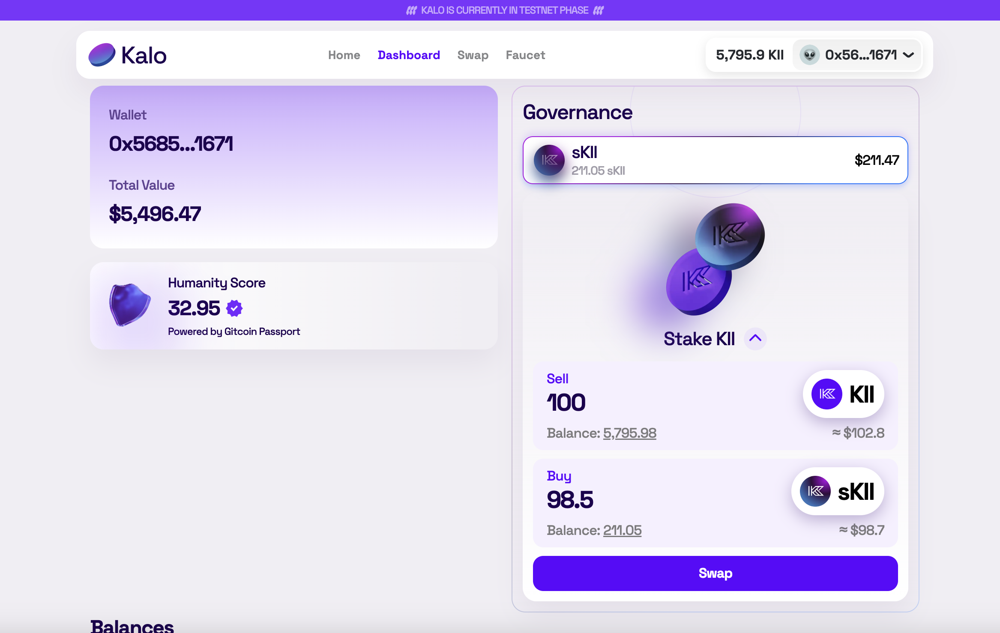
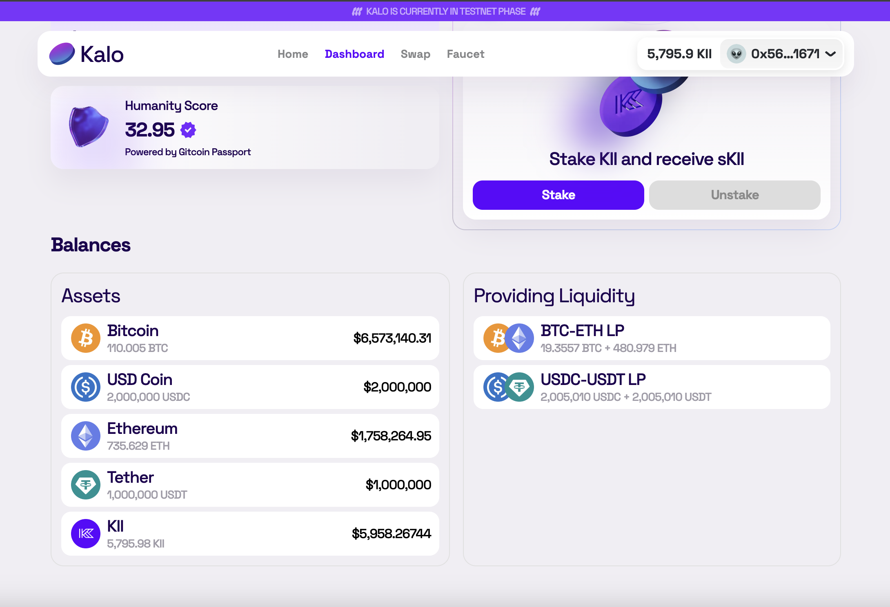
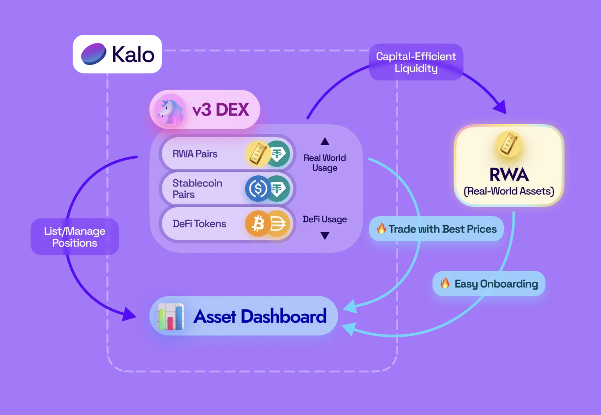

# Kalo



## Background

- KiiChain is a pre-launch stage blockchain based on Cosmos SDK with EVM implementation using Berachain's Polaris, targeting emerging markets and adoption for RWA tokenization & DeFi.
- Our team, Inevitable, is a group of individuals experienced in designing DeFi and creating products from 0-to-1 on various chains.
  Inevitable previously won an award in the 2022 Klaymakers hackathon hosted by DoraHacks for the open-source DeFi dashboard, Bento. Our persistent goal is to help users visualize their scattered state across different chains and protocols, enabling them to identify overlooked opportunities.
- One of the core problems in DeFi is fragmented liquidity and information, which significantly impacts onboarding to the crypto world. Our team's goal was to address this within the DeFi track.
- When new chains emerge (especially those supporting EVM!), there's often a trend of forking existing ecosystem dApps (like SushiSwap, Uniswap) to capitalize on first-mover financial incentives. Naturally, various DApps will be deployed on KiiChain after its launch. This positive trend can increase the overall TVL of the chain's ecosystem, and we assume this will inevitably occur on KiiChain. However, this proliferation of dApps splits liquidity across multiple platforms, forcing users to navigate between apps to find the best prices. Consequently, user activity and states become fragmented across various DeFi platforms, making assets and information harder to track and potentially obscuring opportunities for users.

## Fragmented Information - DeFi Dashboard

We created Kalo, a dashboard where any user can connect their KiiChain wallet to view all their network assets, DeFi positions (currently limited to LP positions on our deployed DEX due to time constraints), and asset values at a glance. Kalo's service is accessible at kii.bento.finance.

### Humanity Score

- Civil attacks, where users create multiple fake wallets to artificially influence the network, are becoming increasingly diverse. Some projects, including the Ethereum Sepolia PoW Faucet, require a Humanity Score as a countermeasure. Gitcoin Passport provides an onchain Humanity Score through unique identity verification. Users submit proofs of various Web2 (e.g., active GitHub or Discord accounts) and Web3 (e.g., owning premium NFTs) activities, which generate a trustworthiness score for their wallet.
- With the growth of airdrops and real-world businesses targeting emerging markets, we added the ability to view Gitcoin Passport scores in Kalo. This allows users to manage their scores directly through the dashboard and provides a metric to identify suspicious wallets.

### One-click Stake and Unstake



- During development, we were impressed by KiiChain's temporary Swap contract provided as a Precompile. It allowed users to freely swap between the native tokens sKII and KII. Although integration was challenging due to an error in the Precompile (which we reported to the KiiChain team via Discord), we deployed a Mocking Contract implementing the ideal sKII behavior. This demo allows users to stake and unstake with a single click. While the original Swap contract required users to manually delegate after receiving sKII, we assumed this process could be abstracted using Polaris precompile magic.
- In production, implementation could follow the Berachain Liquidstaking Precompile Example as an LSD. Given the unstaking period in Cosmos modules, dashboards like Kalo should opt for selling sKII in the existing market to provide immediate KII to users, rather than unstaking. This approach increases delegations on the chain, incentivizes arbitrage, and potentially increases the overall amount of locked KII.
- Ideally, active validators in the KiiChain ecosystem would create these LSDs and manage user-facing apps like Kalo, competing to increase their stake. This is the world Inevitable envisions.

## v3 DEX



- We believe that stablecoins will be key for onboarding emerging market audiences, given the often underdeveloped financial infrastructure and desire to hedge against local currency inflation in these countries. If KiiChain's hypothesis succeeds, it could lead to tremendous adoption. The onramped capital could then interact with real-world assets through RWA Tokenization.
- We chose to implement a Concentrated Liquidity DEX as KiiChain's first DeFi project to demonstrate integration with the dashboard. Unlike CPAMM (Constant Product DEX), CLAMM allows liquidity providers to set their desired price range for liquidity utilization, enabling strategic responses for various asset types. This improved capital efficiency allows users to trade with fewer losses, particularly effective for stablecoins.
- Users can view all their current v3 positions on the dashboard, check the corresponding token quantities based on current reserve ratios (the amount of tokens they would receive if they burned their liquidity position now), and see the calculated valuation.

## Flywheel

We aim to create the following flywheel:



## 🛠️ Developer Docs

### Build

```bash
# frontend
yarn dev
yarn build

# contracts
cd contracts

## Run scripts (some scripts may contain hardcoded values for specific KiiChain deployment (`--network kii`), but using the default Hardhat network is fine)
yarn workspace @kalo/contracts hardhat run scripts/deploy-tokens.ts
yarn workspace @kalo/contracts hardhat run scripts/deploy-univ3.ts
yarn workspace @kalo/contracts hardhat run scripts/deploy-univ3-pools.ts
yarn workspace @kalo/contracts hardhat run scripts/deploy-univ3-quoter.ts

yarn workspace @kalo/contracts hardhat run scripts/deploy-multicall3.ts
yarn workspace @kalo/contracts hardhat run scripts/deploy-mock-skii.ts
```

### Deployed Contracts

### Multicall3

As we're using Viem, we've adhered to their [Custom Chains](https://viem.sh/docs/chains/introduction#custom-chains) specifications and deployed [Multicall3](https://github.com/mds1/multicall) (GitHub) on the KiiChain testnet to enable efficient batched calls.

```
Multicall3 0x032690D03EB035B8D1e43A57086ee5b829ebf316
```

Which we can use like the following:

```ts
export const kiichainTestnet = defineChain({
  id: 123454321,
  name: 'Kiichain Tesnet',
  nativeCurrency: {
    name: 'KII',
    symbol: 'KII',
    decimals: 18,
  },
  rpcUrls: {
    default: {
      http: ['https://a.sentry.testnet.kiivalidator.com:8645'],
    },
  },
  blockExplorers: {
    default: {
      name: 'Kiichain Testnet',
      url: 'https://app.kiiglobal.io/kiichain',
      apiUrl: '',
    },
  },
  contracts: {
    multicall3: {
      address: '0x032690D03EB035B8D1e43A57086ee5b829ebf316',
    },
  },
});
```

### V3 (CLAMM)

Based on Uniswap V3([core](https://github.com/Uniswap/v3-core), [periphery](https://github.com/Uniswap/v3-periphery))'s concentrated liquidity implementation.

```
WETH 0xdeC9F9F51f886Efc1032f5F6472D159dD951A259
UniswapV3Factory 0x0a707f8E245772a3eDB30B6C9C02F26dC43Fcb5c
SwapRouter 0xEEDf468F8cc80BcaF7a22d400BE416CF6AF22fe5
NFTDescriptor 0xe234395b2E0317C169024bE43eFCb3bF4A41D57E
NonfungibleTokenPositionDescriptor 0x1b71634fbE0d9C706daf7EeE8f5eb5f7271CF1C3
NonfungiblePositionManager 0x0f7F9402c26b45134953eCfB55B5082A4C643ee0
QuoterV2 0xD2dF0d33215bF8924Bebb3490494Af50Aa24b7F1
```

### Mocked ERC20s

```js
┌─────────┬────────────┬────────┬──────────┬──────────────────────────────────────────────┐
│ (index) │ name       │ symbol │ decimals │ address                                      │
├─────────┼────────────┼────────┼──────────┼──────────────────────────────────────────────┤
│ 0       │ 'Bitcoin'  │ 'BTC'  │ 8        │ '0x0b65426e7595758Fc6cc64F926e56C8f5382E778' │
│ 1       │ 'Ethereum' │ 'ETH'  │ 18       │ '0xdc0234f76B29b3920fD55bB4322676678FEED5a0' │
│ 2       │ 'Tether'   │ 'USDT' │ 6        │ '0xf506817d2db2FE531b7Ad2B3DFB3173665C4959C' │
│ 3       │ 'USD Coin' │ 'USDC' │ 6        │ '0xc68326408D812507D34eF4b1583cAe2F62953afE' │
│ 4       │ 'Dai'      │ 'DAI'  │ 18       │ '0x3a83359aFCF4eD34Ee76620944a791d6DE910979' │
│ 5       │ 'RWA Gold' │ 'GOLD' │ 18       │ '0xf70893DAf9DeAF1f25C0c67760d6e16A46a19232' │
└─────────┴────────────┴────────┴──────────┴──────────────────────────────────────────────┘
```

### Pools

```js
┌─────────┬─────────────┬──────────────────────────────────────────────┬─────┐
│ (index) │ name        │ address                                      │ fee │
├─────────┼─────────────┼──────────────────────────────────────────────┼─────┤
│ 0       │ 'BTC-ETH'   │ '0xfd3dFCa1CfC4CA38D096A8A509597C0144f3ca36' │ 500 │
│ 1       │ 'USDT-USDC' │ '0x3Eb41EcCC7Dc80dF57A35af685df1aeCdCBf057B' │ 500 │
└─────────┴─────────────┴──────────────────────────────────────────────┴─────┘
```

### Staked KII (Mock)

A simple mock contract for sKII (ERC20 token with a fixed swap ratio of `KII:sKII = 1:0.985`)

```
StakedKII (Mock) 0x8eB71002a452732E4D7DD399fe956a443717C903
```
